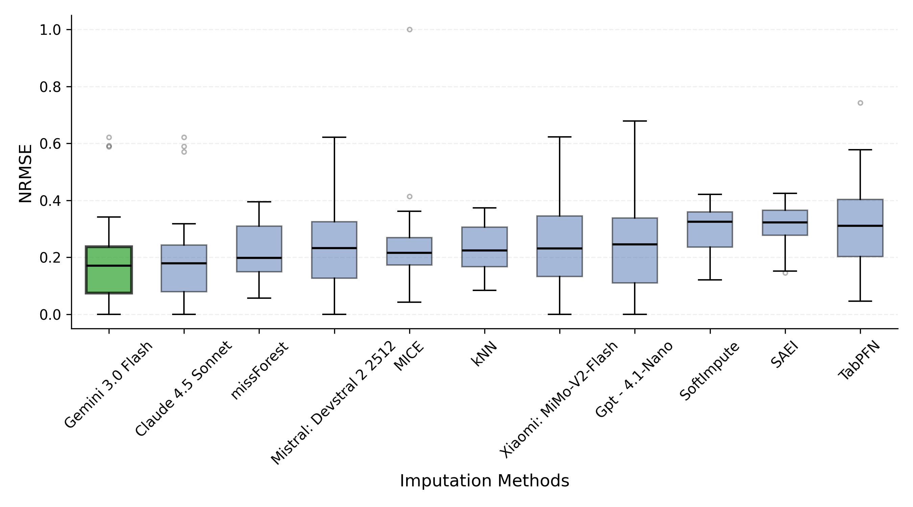
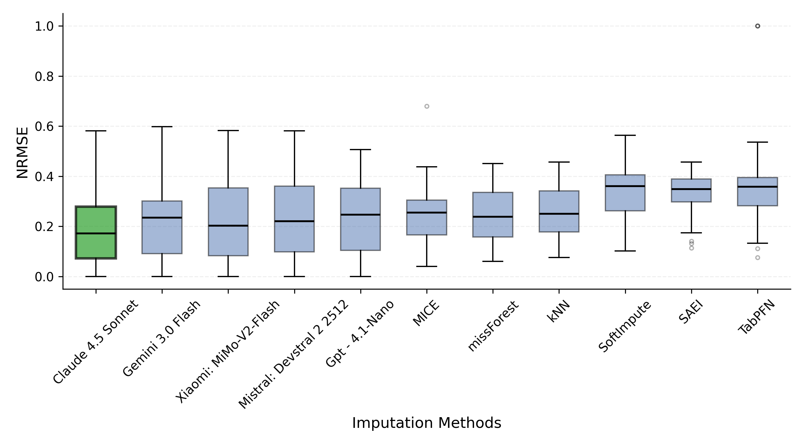
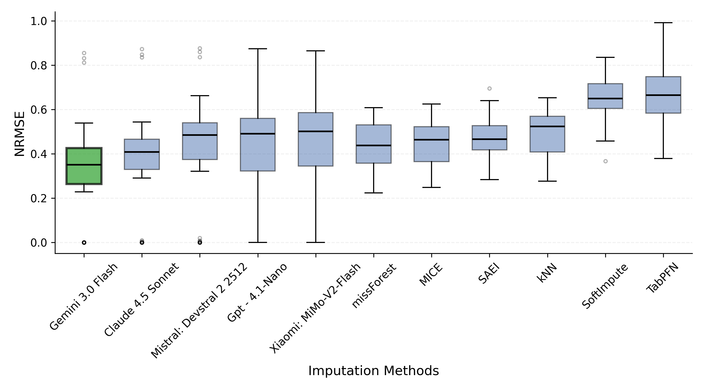
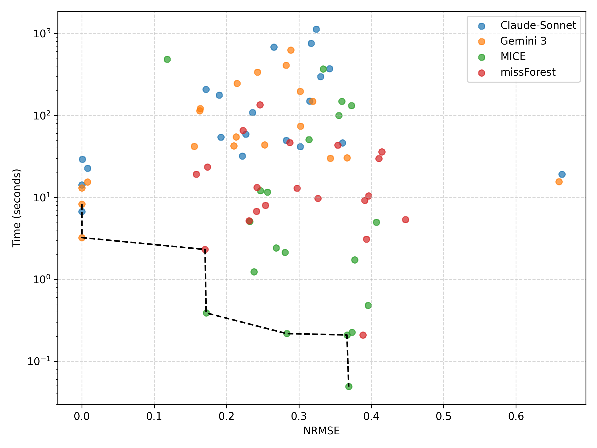

# Large Language Models for Data Imputation: Behavior, Hallucination Effects, and Control Mechanisms

This repository provides a comprehensive experimental framework for evaluating Large Language Models (LLMs) in the context of missing data imputation. The study investigates both performance and behavioral aspects, including hallucination effects and control mechanisms.

## Overview

We evaluate five LLM families across different architectures, including:
- Mistral
- Claude
- GPT
- Gemini

These models are benchmarked against traditional and state-of-the-art imputation methods:
- k-Nearest Neighbors (kNN)
- Multivariate Imputation by Chained Equations (MICE)
- missForest
- Stacked Autoencoder Imputation (SAEI)
- TabPFN

Experiments are conducted under the three standard missing data mechanisms:
- Missing Completely at Random (MCAR)
- Missing at Random (MAR)
- Missing Not at Random (MNAR)

## Results

Empirical results indicate that **Claude 4.5 Sonnet** and **Gemini 3.0 Flash** consistently outperform baseline methods across all missingness mechanisms.

### MCAR


### MAR


### MNAR


In terms of computational efficiency, LLM-based approaches require significantly more resources compared to traditional imputation methods.

## Installation

Install the required dependencies:

```bash
pip install -r requirements.txt
```
We recommend using a dedicated virtual environment that could be found [here](LLM).
```bash
source LLM/bin/activate # On Linux/macOS
.\LLM\Scripts\activate   # On Windows
```

## Computational Considerations



LLMs introduce a substantial computational overhead compared to classical methods. This includes:

- Higher latency due to API calls

- Increased monetary cost (depending on provider)

- Dependency on external services

These aspects should be considered when deploying LLM-based imputation in practice.

## Related Publication

This work has been submitted to IEEE Transactions on Knowledge and Data. Further details will be provided upon publication.
