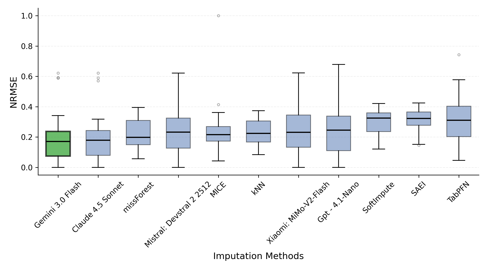
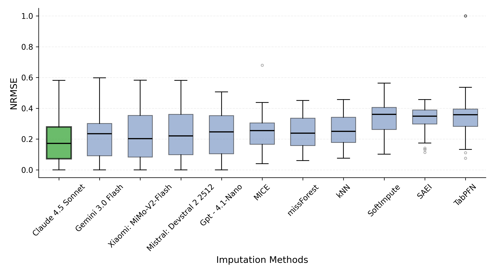
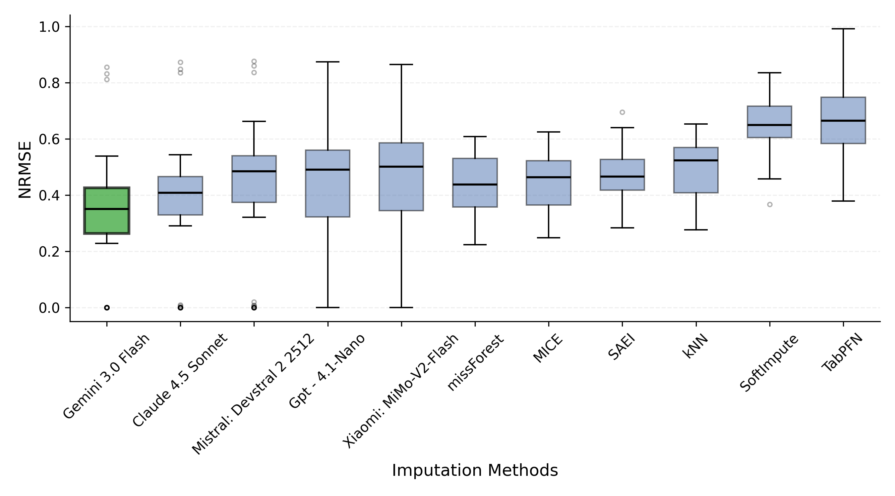
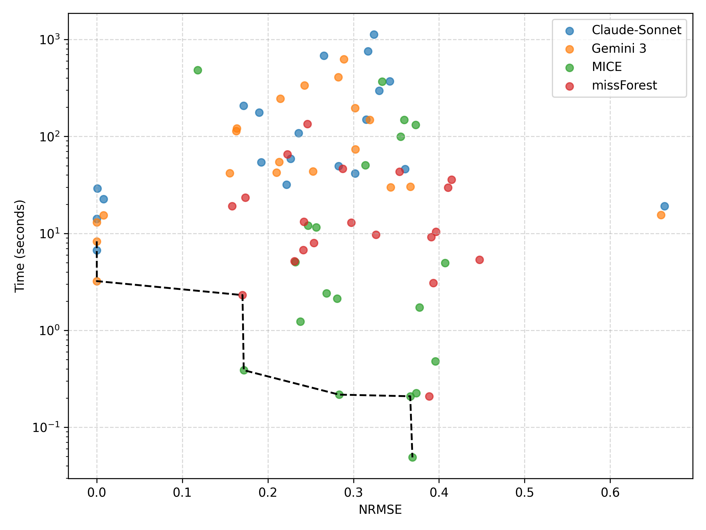

# Large Language Models for Data Imputation: Behavior, Hallucination Effects, and Control Mechanisms

This repository provides a comprehensive experimental framework for evaluating Large Language Models (LLMs) in the context of missing data imputation. The study investigates both performance and behavioral aspects, including hallucination effects and control mechanisms.

## Overview

We evaluate five LLM families across different architectures, including:
- Mistral
- Claude
- GPT
- Gemini

These models are benchmarked against traditional and state-of-the-art imputation methods:
- k-Nearest Neighbors (kNN)
- Multivariate Imputation by Chained Equations (MICE)
- missForest
- Stacked Autoencoder Imputation (SAEI)
- TabPFN

Experiments are conducted under the three standard missing data mechanisms:
- Missing Completely at Random (MCAR)
- Missing at Random (MAR)
- Missing Not at Random (MNAR)

## Results

Empirical results indicate that **Claude 4.5 Sonnet** and **Gemini 3.0 Flash** consistently outperform baseline methods across all missingness mechanisms.

### MCAR


### MAR


### MNAR


In terms of computational efficiency, LLM-based approaches require significantly more resources compared to traditional imputation methods.

## Hallucination Metrics

Beyond accuracy, we introduce two complementary metrics to quantify **hallucination** in imputed values, i.e., imputations that are statistically implausible or that mislead downstream decisions:

- **HIMDI** (Hallucination Index for Missing Data Imputation) — a correlation-weighted, feature-level metric. For each imputed cell, it regresses the target feature on its correlated partner features (fitted on the observed training data) and flags a violation whenever the imputed value falls outside a residual-based tolerance band. Violations are aggregated per feature using a continuous weighting by partner correlation strength, then averaged across features (`codes/himdi.py`).
- **CHRMI** (Consequential Hallucination Rate for Missing Data Imputation) — a cell-level, oracle-based metric that measures *decision-relevant* hallucination. For each imputed cell, an oracle classifier's prediction on the fully imputed row is compared against a counterfactual prediction where only that cell is swapped for its true value, holding all other cells fixed. Under the materiality condition, a cell counts as a hallucination only when the counterfactual swap would have led the oracle to the correct label, isolating imputations that actually flip a downstream decision (`codes/chrmi.py`).

Both metrics are computed post-hoc from already-imputed datasets (LLM-based and classical baselines alike) via `codes/hallucination_metrics.py`, which reproduces the original cross-validation folds and writes per-fold results (`himdi`, `chrmi`, and oracle accuracy) to `results/<model>/Resultados/<mechanism>_Hallucination/`.

## Installation

Install the required dependencies:

```bash
pip install -r requirements.txt
```
We recommend using a dedicated virtual environment that could be found [here](LLM).
```bash
source LLM/bin/activate # On Linux/macOS
.\LLM\Scripts\activate   # On Windows
```

## Computational Considerations



LLMs introduce a substantial computational overhead compared to classical methods. This includes:

- Higher latency due to API calls

- Increased monetary cost (depending on provider)

- Dependency on external services

These aspects should be considered when deploying LLM-based imputation in practice.

## Related Publication
```bash
@article{mangussi2026large,
  title={Large language models for missing data imputation: Understanding behavior, hallucination effects, and control mechanisms},
  author={Mangussi, Arthur Dantas and Pereira, Ricardo Cardoso and Lorena, Ana Carolina and Abreu, Pedro Henriques},
  journal={arXiv preprint arXiv:2603.22332},
  year={2026}
}
```
