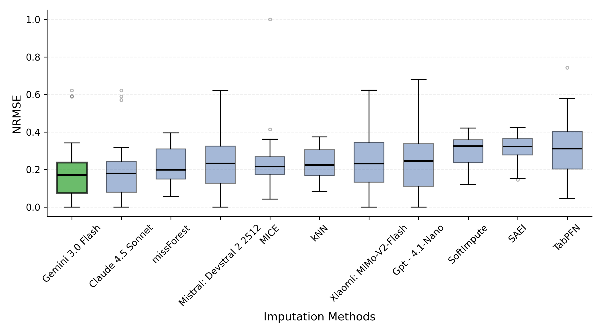
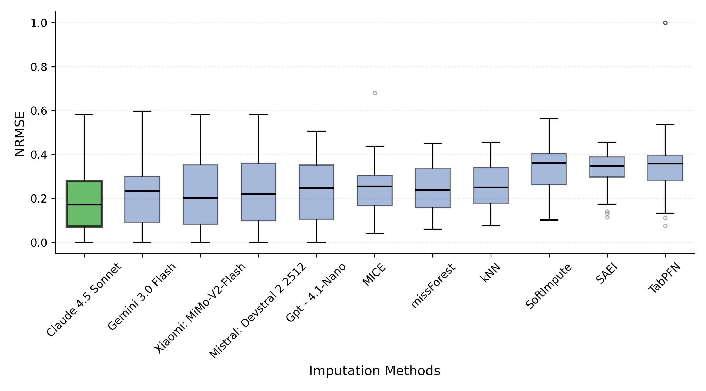
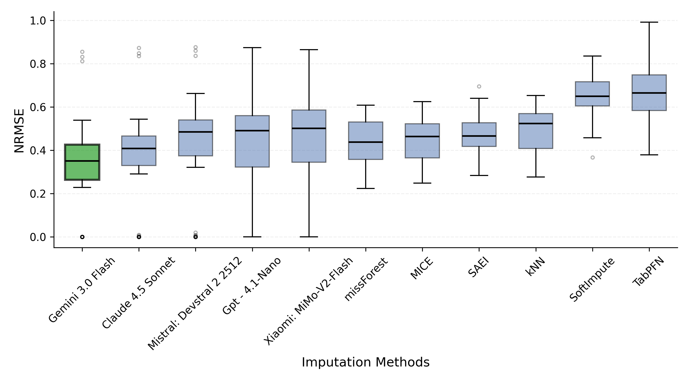
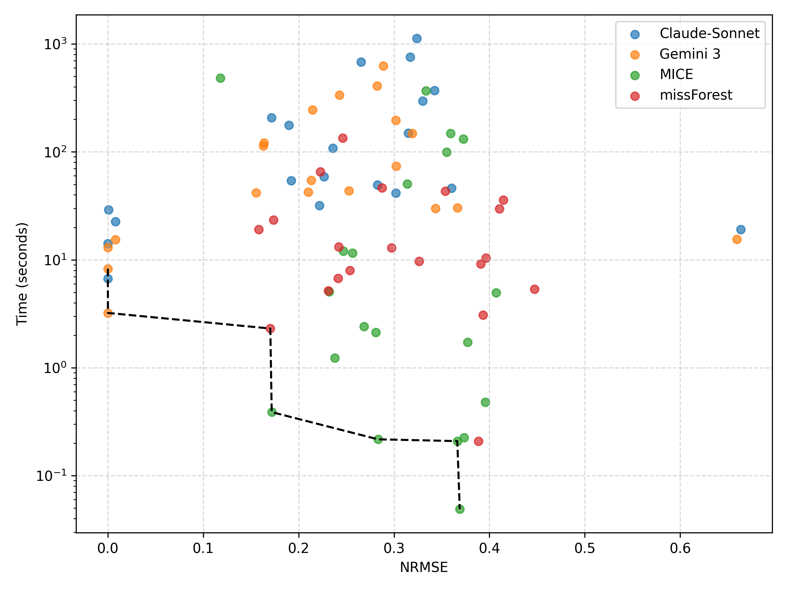

# Large Language Models for Data Imputation: Behavior, Hallucination Effects, and Control Mechanisms

This repository provides a comprehensive experimental framework for evaluating Large Language Models (LLMs) in the context of missing data imputation. The study investigates both performance and behavioral aspects, including hallucination effects and control mechanisms.

## Overview

We evaluate five LLM families across different architectures, including:
- Mistral
- Claude
- GPT
- Gemini

These models are benchmarked against traditional and state-of-the-art imputation methods:
- k-Nearest Neighbors (kNN)
- Multivariate Imputation by Chained Equations (MICE)
- missForest
- Stacked Autoencoder Imputation (SAEI)
- TabPFN

Experiments are conducted under the three standard missing data mechanisms:
- Missing Completely at Random (MCAR)
- Missing at Random (MAR)
- Missing Not at Random (MNAR)

## Results

Empirical results indicate that **Claude 4.5 Sonnet** and **Gemini 3.0 Flash** consistently outperform baseline methods across all missingness mechanisms.

### MCAR


### MAR


### MNAR


In terms of computational efficiency, LLM-based approaches require significantly more resources compared to traditional imputation methods.

## Hallucination Metrics

Beyond accuracy, we introduce two complementary metrics to quantify **hallucination** in imputed values, i.e., imputations that are statistically implausible or that mislead downstream decisions:

- **HIMDI** (Hallucination Index for Missing Data Imputation) — a correlation-weighted, feature-level metric. For each imputed cell, it regresses the target feature on its correlated partner features (fitted on the observed training data) and flags a violation whenever the imputed value falls outside a residual-based tolerance band. Violations are aggregated per feature using a continuous weighting by partner correlation strength, then averaged across features (`codes/himdi.py`).
- **CHRMI** (Consequential Hallucination Rate for Missing Data Imputation) — a row-level, oracle-based metric that measures how imputation shifts *classification difficulty*. An oracle classifier (XGBoost, trained on the fully observed training rows) scores each test row that has at least one imputed value, both in its original and imputed form. Difficulty is defined as $D(x) = 1 - P(y \mid x)$, and the per-row score is $\delta_i = D(x_i^{\text{true}}) - D(\hat{x}_i)$. A positive $\delta_i$ means the imputed values made the row *too easy* to classify, collapsing uncertainty the real data does not support (fabricated label signal); a negative one means they made it *too hard*, which is information loss rather than hallucination. We report the signed mean (`chrmi`), the mean absolute value (`chrmi_abs`), and the positive part `chrmi_plus` $= \overline{\max(\delta_i, 0)}$, which is the hallucination-relevant side (`codes/chrmi.py`).
- **MOWI index** — a combined row-level index grounded in the MOWI framework of Ho et al. (2026), which defines hallucination as a commitment to *material* information that is *not derivable* from the reference state. HIMDI covers the *Model* level (is the imputed value supported by the data manifold?) and CHRMI⁺ covers the *World* level (does it claim more certainty than reality allows?). Per row, $H_i = h_i \cdot \max(\delta_i, 0)$, where $h_i$ is the mean per-cell HIMDI violation over the row's imputed cells; the product acts as a soft AND, so a row only counts when both conditions hold. We report `mowi` (mean of $H_i$), `mowi_max` (with $h_i$ as the max over cells), `mowi_rate` (fraction of rows with $h_i > 0.5$ and $\delta_i > 0.05$), and the components `h_mean` and `delta_plus_mean` (`codes/mowi_index.py`). The *Input* level (row sparsity, missingness mechanism) is intentionally left out of the index and treated as an explanatory factor instead.

All metrics are computed post-hoc from already-imputed datasets (LLM-based and classical baselines alike) via `codes/hallucination_metrics.py`, which reproduces the original cross-validation folds and writes per-fold results (HIMDI, CHRMI, MOWI index, and oracle accuracy) to `results/<model>/Resultados/<mechanism>_Hallucination/`.

## Installation

Install the required dependencies:

```bash
pip install -r requirements.txt
```
We recommend using a dedicated virtual environment that could be found [here](LLM).
```bash
source LLM/bin/activate # On Linux/macOS
.\LLM\Scripts\activate   # On Windows
```

## Computational Considerations



LLMs introduce a substantial computational overhead compared to classical methods. This includes:

- Higher latency due to API calls

- Increased monetary cost (depending on provider)

- Dependency on external services

These aspects should be considered when deploying LLM-based imputation in practice.

## Related Publication
```bash
@article{mangussi2026large,
  title={Large language models for missing data imputation: Understanding behavior, hallucination effects, and control mechanisms},
  author={Mangussi, Arthur Dantas and Pereira, Ricardo Cardoso and Lorena, Ana Carolina and Abreu, Pedro Henriques},
  journal={arXiv preprint arXiv:2603.22332},
  year={2026}
}
```
